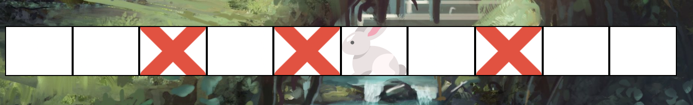

## Rabbit Hole Game

#### A simple game to simulate the rabbit hole problem.

## Inspiration
Dillon William's [ElusiveRabbit Repository](https://github.com/DillonRmD/ElusiveRabbit) was a great starting point for this project. He describes the problem and the solution in his [README](https://github.com/DillonRmD/ElusiveRabbit/blob/main/README.md).

## Project Screen Shot(s)

<li> Main Menu </li>
 
  

<li> Game Screen </li>
 

## Installation and Setup Instructions
Clone down this repository. You will need `node` and `npm` installed globally on your machine.  

Installation:

`npm install`  

To Start Server:

`npm start`  

To Visit App:

`localhost:3000`  

## Reflection

This was a fun little project built because of a conversation with a friend.

Orignally, I wanted to make a visual representation of Dillon's rabbit hole problem algorithm. I decided instead to turn it into a game.

I started this process by using the `create-react-app` boilerplate, then adding `material-ui` to the project.  

One of the main challenges I ran into was correctly updating the state of the game. Correctly updating several different components was a fun challenge. I had to learn how to utilize the asynchronous nature of React to update the state of the game. I also had to learn how to properly update objects within the game.

At the end of the day, the technologies implemented in this project are React, Material-UI, and a decent amount of VanillaJS, JSX, and CSS. I chose to use the `create-react-app` boilerplate to minimize initial setup and invest more time in diving into weird technological rabbit holes (pun). In the next iteration I plan on rewritting the project using TypeScript instead of vanilla JS.